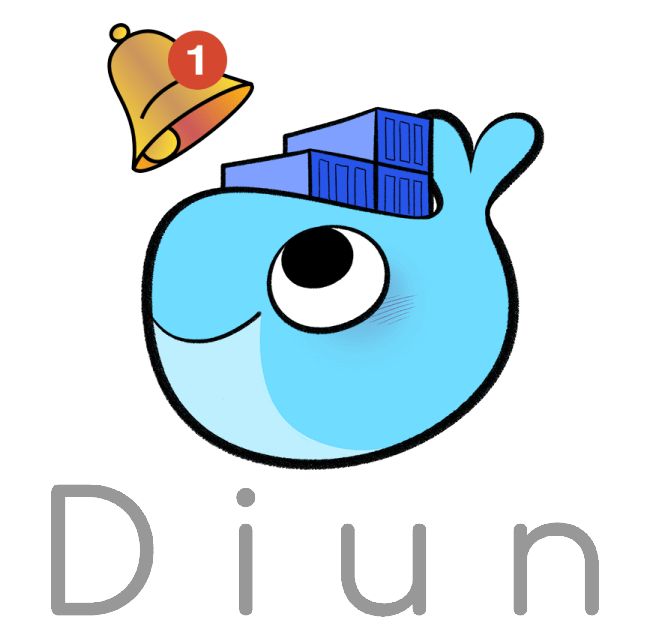

#  Tyzen9 - docker-insight
This all-in-one Docker stack combines Glances, DIUN, and socket-proxy to deliver comprehensive insight into your Docker host’s health, provide timely Docker image update notifications, and enforce controlled, secure access to the Docker API via a hardened socket proxy. Together, these containers form the foundation of a robust monitoring solution built on industry-standard, open-source technologies.

This stack enables strong security and performance monitoring by restricting Docker socket access to necessary services, continuously tracking system and container metrics, and alerting you when updates are available—ensuring your Docker environment remains both secure and up-to-date.

<p align="center">
&nbsp;&nbsp;&nbsp;&nbsp;&nbsp;&nbsp;&nbsp;&nbsp;

</p> 

## Prerequisites
In production it's generally best to use [Docker Engine](https://docs.docker.com/get-docker/) on a Linux host operating system, and a lightweight service delivery platform designed for managing containerized applications such as [Portainer](https://www.portainer.io/). This documentation assumes you have a working knowledge of [Docker](https://www.docker.com/).

## Configuration
This `docker-compose` implementation is configured using the `environment` section of the `compose.yaml` file.  
The full list of config options are documented on:

# What's Inside?
The docker-insight stack contains everything you need for a robust docker host and container monitoring solution. Here is what this project has to offer:

1. [Diun](https://crazymax.dev/diun)
1. [Glances](https://glances.readthedocs.io/en/latest/docker.html)
1. [Socket-Proxy](https://github.com/linuxserver/docker-socket-proxy)

## Getting Started
Deploy the stack into your Docker environment. This can be done by cloning this repository, by downloading the most recent [release](https://github.com/tyzen9/docker-insight/releases) .zip file, or just by simply copying the content of the `compose.yml` file and `sample.env` above. 

1. Make a copy of `sample.env`, and name it `.env`
1. Set the configuration options as desired in the `compose.yaml` and `.env` files.
1. Navigate to the project's root directory and run the following command:

```
docker compose up
```

If everything works as expected, you should be able to access Glances at http://hostname:61208.

> [!NOTE]
>This documentation assumes you have a working knowledge of [Docker](https://www.docker.com/), [Diun](https://crazymax.dev/diun/), and [Glances](https://glances.readthedocs.io/en/latest/) and [Socket-Proxy](https://github.com/linuxserver/docker-socket-proxy).

# Duin 
Diun (Docker Image Update Notifier) is a lightweight, self-hosted service 
that monitors your Docker images and sends notifications whenever updates 
are available. It helps keep environments secure and up to date by 
integrating with registries and notification providers such as email, 
Slack, Gotify, and more. Designed to run alongside your Docker services, 
Diun ensures you are always aware of new image versions so you can quickly 
apply updates while maintaining control of your deployment lifecycle.

> [!Note]
> `Duin` can be configured any number of ways. Please review the [Diun](https://crazymax.dev/diun) documentation for details.


## Pushover Configuration
If plans are to use Diun to send [Pushover](https://pushover.net/) notifications, then be sure to set the `DIUN_NOTIF_PUSHOVER_TOKEN` and `DIUN_NOTIF_PUSHOVER_RECIPIENT` keys appropriately when deploying this container.

### Testing Pushover Notifications
Test the configured notification by running this command on the docker host machine:

```
docker exec [container-name] diun notif test
```

# Glances
Glances is a cross-platform, real-time system monitoring tool that provides 
a comprehensive overview of system metrics such as CPU usage, memory, disk 
I/O, network activity, and running processes. It is accessible through a 
web-based interface, CLI, or API, making it versatile for local and remote 
monitoring. Designed for efficiency and low resource usage, Glances helps 
users track performance, identify bottlenecks, and maintain system health 
across servers, containers, and embedded devices.  

Glances is available at http://hostname:61208.

## Configuration
Glances can be configured any number of ways.  Use this Docker stack as a starting point, and reference the [Glances](https://glances.readthedocs.io/en/latest/docker.html) documentation to configure this service to fit the need.

# Docker Socket-Proxy
Socket Proxy is a security-enhanced proxy for the Docker socket that 
restricts and controls access to the Docker API. By filtering Docker 
socket requests based on configurable rules, it limits the attack surface 
for containers requiring Docker socket access, such as Traefik or Watchtower. 
This proxy helps prevent unauthorized or dangerous Docker operations, 
enhancing container and host security while allowing necessary Docker API 
communication.

## Common Integrations with `docker socket-proxy`

### 1. Container management tools
- **Portainer** → manage containers, images, networks, volumes.
- **Dozzle** / **Lazydocker** → container log viewing.
- **Docker-Compose GUIs** (e.g., Yacht).

### 2. Monitoring & metrics
- **Prometheus exporters** (e.g., `docker_exporter`).
- **cAdvisor** → container resource usage.
- **Glances** with Docker integration.

### 3. Reverse proxies & service discovery
- **Traefik** → auto-discovers containers via Docker labels.
- **Nginx Proxy Manager** (when using Docker integration).
- **Caddy** (with Docker plugin).

### 4. Automation / orchestration
- **Watchtower** → auto-updates running containers.
- **Ofelia** → scheduled container jobs.
- **GitOps/CD tools** (e.g., Drone runners, CI pipelines that deploy with Docker API).

### 5. Custom scripts or apps
- Anything needing Docker **events**, **logs**, **stats**, or **lifecycle management**.
